<h1 align="center">
    
</h1>
<h1 align = "center"> Signos </h1>

O projeto de signos foi desenvolvido em sala de aula como prova prática do android studio, onde podiamos escolher entre os projetos: Signo, Tipo Sanguíneo e Calculo do IMC.
    Neste caso o escolhido foi o de Signos. A tela desenvolvida pede para que o usuário informe o dia e o mês em que nasceu e com essas informações é exibido o signo do usuário. 
    Programado em linguagem kotlin.

 

<h1 align="center">
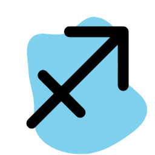 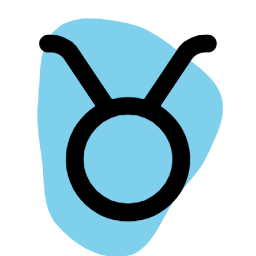
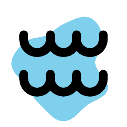 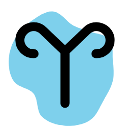 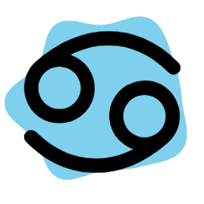
 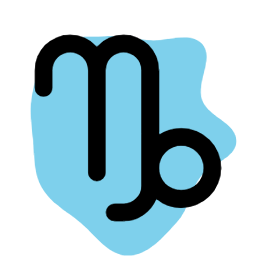 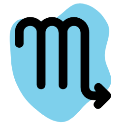 
 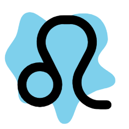 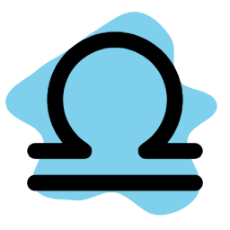 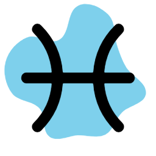 
 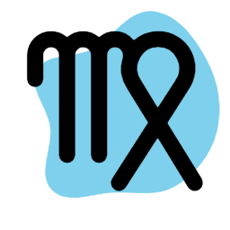

</h1>

<h1 align="center"> 

</h1>
 AUTORES

   

 Erika Santana 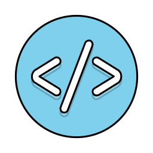

Geovana Nascimento  

